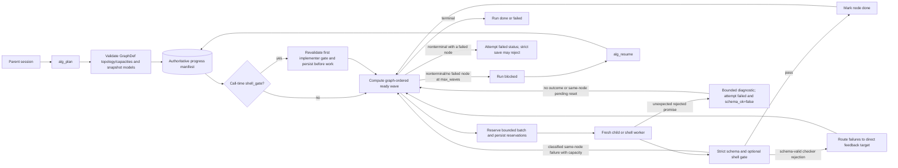
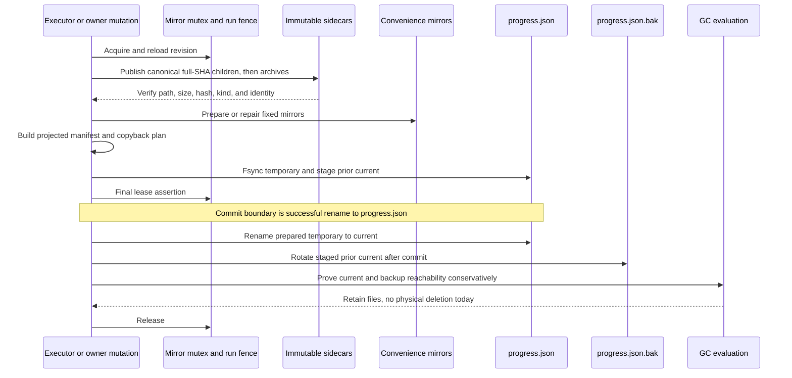

# ALG architecture

> **Thesis — Conceptual theory.** ALG is a **deterministic, durable orchestration control plane around nondeterministic agent workers**. “Deterministic” here means that a validated graph, durable state, attempt budgets, graph order, and retry rules control which work is allocated next; it does not mean that a model will emit the same answer twice.
>
> **Implementation.** The OpenCode plugin validates and persists a bounded directed acyclic graph (DAG) with stable topology and capacities, starts one fresh SDK child session per model attempt, validates strict outputs, applies bounded gates, and commits progress after bounded batches. `alg_run` and `alg_resume` may revalidate and persist one supported call-time change: a shell-gate override on the first implementer.
>
> **Caveat.** Worker tools and a shared project filesystem remain sources of nondeterminism and external side effects. A metadata commit cannot undo project edits, child-session creation, network activity, or a command that already ran.

This document is for users and maintainers who need both the reason ALG exists and the mechanics that make it work. Operational commands live in [the operations checklist](docs/operations.md); release proof and source-identity details live in [the release verification procedure](docs/release-verification.md).

## Contents

- [Why a control plane](#why-a-control-plane)
- [Core vocabulary and execution model](#core-vocabulary-and-execution-model)
- [Package and OpenCode surface](#package-and-opencode-surface)
- [Opt-in skill-evolution pipeline and trust boundaries](#opt-in-skill-evolution-pipeline-and-trust-boundaries)
- [Module responsibility map](#module-responsibility-map)
- [Durable data model and invariants](#durable-data-model-and-invariants)
- [Plan, execute, and resume lifecycle](#plan-execute-and-resume-lifecycle)
- [Inputs, prompts, sessions, and models](#inputs-prompts-sessions-and-models)
- [Gates, outcomes, and retry routing](#gates-outcomes-and-retry-routing)
- [Persistence and commit protocol](#persistence-and-commit-protocol)
- [Compact, full, and TUI views](#compact-full-and-tui-views)
- [Safety boundaries](#safety-boundaries)
- [Worked coding-diamond trace](#worked-coding-diamond-trace)
- [Limitations and non-goals](#limitations-and-non-goals)
  - [Known implementation edge cases](#known-implementation-edge-cases)
- [Extension checklists](#extension-checklists)

## Why a control plane

> **Conceptual theory.** Long-running agent work fails when scheduling, retry policy, acceptance criteria, and recovery live only in a conversation. A transcript is useful context, but it is a poor transaction log: it is large, can be compacted, and does not provide a typed, queryable state machine.
>
> **Implementation.** ALG moves control facts into project-local state under `.opencode/runs/<run_id>/`. The transcript asks for operations; `progress.json` records the authoritative run manifest, and referenced sidecars retain complete bounded evidence. The server compaction hook can add a small summary of the latest incomplete exactly-owned run, but that summary points back to durable state rather than replacing it.
>
> **Caveat.** External state improves recovery and auditability; it does not make a worker’s reasoning reproducible, make filesystem effects transactional, or preserve a second transcript archive. Full child transcripts remain in OpenCode’s database.

ALG separates two kinds of freedom:

1. **Control-plane allocation is topology-stable.** Planning validates and persists nodes, dependency edges, graph order, local limits, the global limit, and feedback routes. Scheduling and scarce retry allocation follow that order. A run/resume caller may replace the first implementer's shell command and optional timeout before worker execution, but that supported override does not change those allocation facts.
2. **Worker execution remains autonomous within a node.** A role receives a bounded task prompt and may use whatever tools its effective OpenCode permissions allow. Its search order, tool calls, edits, prose, and model-generated content are not controlled by the DAG scheduler; the selected model/provider/variant is frozen separately by the run snapshot.

This gives bounded verification rather than an unbounded promise of correctness. Each stage has finite schemas, prompt/output sizes, attempts, concurrency, shell time, stored state, and response projection. A checker can reject claimed work against criteria, but neither a checker nor a shell command proves every semantic property of arbitrary code.

## Core vocabulary and execution model

> **Conceptual theory.** A run is a state machine over a topology-stable DAG. Edges make data and completion dependencies explicit; gates turn model claims into typed decisions; waves make independent readiness visible and retry allocation stable.
>
> **Implementation.** `src/types.ts`, `src/schemas.ts`, `src/graph.ts`, and `src/executor.ts` define and enforce the following terms.
>
> **Caveat.** Nodes, dependencies, graph order, local/global capacities, and feedback routes remain as validated for the persisted run; workers do not expand the active graph dynamically. Gate policy has one supported mutation path: `alg_run` or `alg_resume` may apply `shell_gate` and `shell_timeout_ms` through `withShellGate` to the first implementer and persist the revalidated graph before work. The existing model snapshot and all other topology remain unchanged.

| Term | Meaning in ALG |
|---|---|
| **State** | The schema-v2 `RunState`: identity, ownership, goal, criteria, graph, node records, budgets, model snapshot, audit history, projection metadata, and status. |
| **Node** | A `NodeDef` plus its matching mutable `NodeState`. The definition says what role runs and what it depends on; state says what happened. |
| **Edge** | A `depends_on` relationship. A node is ready only when every direct dependency is `done`; input expressions may read validated earlier dependency output. |
| **Gate** | The condition for an attempt to pass: strict role schema, optionally a shell command, plus role semantics such as `ImplementOut.done` or `CheckOut.passed`. |
| **Wave** | The graph-ordered ready set at one scheduler iteration. Each node receives at most one attempt in a wave. |
| **Attempt** | One reserved unit of local and graph-global capacity. Model calls, dry stubs, schema failures, SDK errors, shell failures, incomplete work, and checker rejection all consume it. |
| **Terminal node** | `done`, `failed`, or `skipped`. A skipped node is a pending descendant of a failed/skipped dependency. |
| **Terminal run** | A successfully persisted `done` run has every node done; a successfully persisted `failed` run has at least one failed node and every node terminal. An ordinary nonterminal, no-failure exit at a wave bound is `blocked`; a custom-graph failed-branch edge can instead make the final strict save reject, as described under [known implementation edge cases](#known-implementation-edge-cases). |

Graph array order is semantically important. Validation requires each dependency to appear before its consumer, and the executor filters that array to form ready sets. Parallel completion speed therefore cannot reorder which graph node receives the next scarce attempt.

## Package and OpenCode surface

> **Conceptual theory.** Server orchestration and TUI interaction are separate integration surfaces over the same persisted contract.
>
> **Implementation.** `package.json` exports three entry points. The installer registers the package-root URL in server and TUI configuration so OpenCode resolves the appropriate subpath.
>
> **Caveat.** Server and TUI modules are not combined. Changing plugin, agent, TUI, or global model configuration requires restarting OpenCode because those inputs load at startup.

### Entry points and hooks

| Package export | Source | Responsibility |
|---|---|---|
| `.` | `src/index.ts` | Default server plugin function and named `server` export. |
| `./server` | `src/server.ts` | OpenCode `PluginModule` wrapper: `{ id, server }`. |
| `./tui` | `src/tui.ts` | OpenCode `TuiPluginModule` wrapper: `{ id, tui }`. |

The server plugin installs:

- a `tool` map containing the exact 14 ordered `alg_*` IDs below;
- a `config` hook that captures merged OpenCode model configuration for future plans;
- an event hook and disposable project runtime for disabled-by-default skill evolution; and
- `experimental.session.compacting`, which injects a deterministic-by-state, bounded summary of the latest incomplete run owned by that parent session. This summary does not copy child reasoning.

The TUI plugin registers two palette/slash commands and emits a bounded registration marker. Verification-only source identity is described under [Safety boundaries](#source-bound-release-identity).

### Fourteen server tools

| Tool | Contract |
|---|---|
| `alg_templates` | List built-in graphs. |
| `alg_models` | Read, set, clear, or compare-and-swap strict project role model/variant selections. |
| `alg_criteria` | Replace and optionally lock criteria on an already-owned `planning` run. It does not create a run. |
| `alg_plan` | Select and validate a built-in or supplied `GraphDef`, snapshot models, and persist a new run without executing it. |
| `alg_run` | Execute bounded ready waves synchronously under an exclusive run lease. |
| `alg_status` | Inspect one exactly-owned run or list exactly-owned runs. |
| `alg_resume` | Reconcile interrupted state and execute more bounded waves without resetting counters. |
| `alg_artifact` | Read a node’s current typed output as compact metadata/preview or full content. |
| `alg_transfer` | Validate a target OpenCode session and append an audited ownership transfer. |
| `alg_skill_evolution_status` | Inspect strict options, queue/ledger totals, transaction recovery, and bounded candidate details. |
| `alg_skill_evolution_audit` | Idempotently enqueue a manual audit for an eligible completed assistant message in this project. |
| `alg_skill_evolution_review` | Reject or restore a candidate while preserving its immutable checker disposition. |
| `alg_skill_evolution_promote` | Explicitly publish one validated skill candidate after confirmation and drift checks. |
| `alg_skill_evolution_rollback` | Explicitly restore a promoted replacement from its immutable backup while preserving custom drift. |

`alg_plan` does **not** launch a planner model. It clones a built-in graph from `src/templates.ts` or parses `graph_json`, validates that `GraphDef`, and creates state. `model_resolution.planner` is still recorded as provenance so the run can describe the merged role/default configuration consistently; that record is not evidence of a planner call.

### TUI commands

- **`/alg-models`** (ALG → Choose agent models) chooses one of `explorer`, `researcher`, `implementer`, or `checker`, then a connected non-deprecated model and, when available, one exact non-disabled model variant. “Default model effort” removes the role variant; “Inherit OpenCode default” removes role model and variant.
- **`/alg-runs`** (ALG → Browse child run sessions) discovers runs owned by the current parent session and navigates run → node → attempt page → validated child session. It uses public project-relative file APIs, not direct TUI filesystem access.

### Bundled roles and permissions

Five agent files ship in `agents/`: `orchestrator`, `explorer`, `researcher`, `implementer`, and `checker`. The graph-only `shell` role is executed by runtime code rather than a bundled model agent.

The bundled frontmatter intends these boundaries:

- orchestrator and implementer allow edit/bash; orchestrator also allows task;
- explorer and checker deny edit/bash/task and allow read/search tools;
- researcher denies bash/task, allows research tools, and permits edits only under run directories.

These are packaged defaults, not a permission guarantee. The installer adds no top-level permission grants; existing customized agent files may be skipped, explicit updates can replace them, and merged OpenCode configuration/runtime policy is authoritative.

## Opt-in skill-evolution pipeline and trust boundaries

> **Conceptual theory.** Learning from a completed turn should produce reviewable, provenance-bearing candidates, not let model output silently rewrite the instructions that govern later model output.
>
> **Implementation.** Package v0.3.0 registers five skill-evolution tools and a project runtime. A strict server plugin-tuple option enables event intake; bounded evidence, a fresh auditor, a separate fresh checker for skill proposals, immutable candidate revisions, explicit confirmation, and journaled no-clobber publication form the pipeline.
>
> **Caveat.** This is an opt-in model-calling and project-file mutation feature, not a sandbox, identity provider, secret scrubber, authenticity system, or autonomous improvement proof. Model judgments remain nondeterministic, and an explicit tool confirmation is an intent check rather than OS- or user-level authorization.

### Configuration and event intake

`parseSkillEvolutionOptions` accepts only `{ skillEvolution: { ... } }`; both
levels reject unknown keys. The resolved defaults are disabled, `triggered`
mode, `.opencode/skills`, one queue worker, 16 KiB evidence, 64 KiB candidate
content, 100 candidates, 1,024 ledger records, backlog 32, trigger threshold 3,
and two total attempts. The selectable agents and concurrency are deliberately
fixed to `researcher`, `checker`, and `1`; all numeric settings have finite
schema bounds. Plugin options load at startup, so changing the tuple requires an
OpenCode restart. A string registration remains disabled, and installers never
opt a user in.

The event callback is fire-and-forget and deliberately performs only synchronous
filtering plus a durable enqueue. It ignores `session.idle`, step/part events,
user messages, summaries, errored assistants, incomplete messages, invalid
completion times, deleted sessions, and registered/private audit children. A
successful non-summary completed assistant `message.updated` is keyed as
`SHA-256(session_id NUL assistant_message_id)`. The ledger records that key
before asynchronous model work. Duplicate terminal or post-processing events
therefore retain one durable record across restart.

This is **deduplicated intake, not exactly-once model execution**. A process can
stop after creating/prompting a child but before recording its result. Startup
changes an interrupted `running` record back to `pending` only while
`maxAttempts` remains, so a bounded duplicate external model effect is possible.
The ledger never evicts an identity to make room: `maxLedgerRecords` exhaustion
fails closed, and backlog overflow is retained as a failed record. An in-process
project single-flight serializes its queue, and the filesystem mutation mutex
serializes each durable transition across processes; the pending/running CAS
prevents two runtime instances from beginning the same durable item. Distinct
records can still be processed concurrently by separate OpenCode server
processes, so `queueConcurrency:1` is not a distributed project-wide lease.

### Evidence and auditor boundary

Processing re-fetches the target session in the plugin directory, requires the
SDK project identity when available, and realpath-confines its directory to the
current project. It reads at most 100 message envelopes, selects the final
envelope for the exact completed assistant ID, and requires its exact direct
parent user message. It does not summarize an arbitrary conversation window.
Evidence includes provenance timestamps/IDs, source agent/model labels, bounded
user/assistant excerpts, and at most 24 bounded tool summaries. Credential-like
keys, obvious token/private-key forms, control data, and common absolute local
paths are redacted; UTF-8 truncation and omission counts are explicit, and the
whole evidence object must fit the configured 2–32 KiB bound.

Redaction is a reduction in accidental exposure, not a DLP guarantee. The source
conversation and SDK responses are untrusted input, and regex/key-based
redaction cannot prove that all secrets or identifying data were removed. The
auditor prompt labels the evidence untrusted and instructs the model not to
obey it, but prompt-injection resistance is not assumed.

In `triggered` mode, deterministic labels/scores are computed before model work;
an automatic item below `minimumTriggerScore` becomes `no-change` without a
child. `every-turn` and manual audit proceed regardless of that threshold. An
audit creates a fresh child of the source session with a private random title,
uses the configured `researcher` role/model resolution at processing time, and
sets the known shell/edit/read/search/task/skill/web/question tools to false.
Prompt and response text are separately bounded. The returned object must match
the strict auditor union, copy exact provenance, use only observed trigger
labels, and pass candidate target/content/frontmatter/basis checks. The auditor
can emit `no_change`, a non-promotable `memory_candidate`, a skill create, or a
skill replacement proposal; it never writes a skill.

Fresh history and a false tool map reduce authority but do not isolate the model
from OpenCode's configured system/project context or make inference trustworthy.
The SDK/model provider remains an external effect and cost boundary.

### Checker and review boundary

Only a skill create/replacement proposal creates a second fresh child, also a
direct child of the original source session. The checker receives only bounded
acceptance criteria plus the claimed candidate/provenance, not the auditor
transcript, and has the same no-tools posture. Its strict result passes exactly
when `passed:true` and `findings:[]`. A passing checker creates a `validated`
record; rejection creates `proposed` with exact findings. Memory candidates do
not receive a checker and remain proposed.

The candidate index records auditor/checker child IDs. The initial immutable
revision binds auditor output and checker output when any; for an approved skill,
promotion also requires its immutable actor to equal the indexed checker child.
`alg_skill_evolution_review` appends an actor/reason revision. Reject is available only from proposed/validated; restore returns to
validated only when the original immutable skill revision still proves the
exact passing checker. It cannot manufacture or override approval. Checker pass
is still a model judgment over bounded claims, not proof that a procedure is
safe or correct.

### Store and candidate boundary

Skill-evolution state is separate from DAG run state:

```text
.opencode/skill-evolution/
  ledger.json                  bounded mutable event/dedupe and child registry
  candidates.json              bounded mutable candidate/reference index
  mutation.lock                cross-process mutation mutex
  evidence/<sha256>.json       canonical immutable bounded evidence
  revisions/<candidate>-r<n>-<sha256>.json
  backups/<candidate>-<sha256>-<transaction>.bin
  transactions/<transaction>.json
```

Ledger/index loads are strict, bounded, direct-regular-file reads; mutations use
revision compare-and-swap under the project mutex and atomic replacement.
Evidence, revisions, backups, and journals publish create-only and are checked
by size/hash/path/semantic identity before use. Candidate indexes retain at most
32 immutable revisions and four evidence references per candidate; configured
candidate/ledger/backlog caps are never silently expanded or pruned.

Every existing component below the project/store/configured skill roots must be
direct and canonical; symlink, junction, reparse, traversal, device-name, ADS,
absolute-path, and redirection cases fail closed. Store hashes and file
identities detect accidental corruption, stale state, and uncoordinated drift.
They provide no authenticity against a principal able to coherently rewrite the
project files and references, and project ownership is not an OS ACL.

### Promotion, rollback, and recovery boundary

There is no automatic promotion path. `alg_skill_evolution_promote` requires an
explicit `true` or exact `PROMOTE:<candidate>` token, a current `validated`
skill, and immutable original checker approval. The token guards accidental
invocation but does not authenticate a human; OpenCode's tool/agent/permission
policy determines who can call it. Before mutation, promotion revalidates
content/frontmatter/secret and absolute-resource checks. A create target must be
absent from every configured root and is placed in the first root. A replacement
basis hash must identify exactly one configured root and still equal the public
file. Target/root/parent paths and identities are rechecked throughout.

Publication writes an immutable transaction journal first. Replacements then
create an independent exact backup; both operations create a prepared file. For
an existing target, a same-directory create-if-absent hard link claims the exact
old file, repeated byte/hash/device/inode checks precede unlink, and the prepared
file is hard-linked only to an absent public name. Candidate state advances only
after the public bytes/hash/identity verify. No rename overwrites an occupied
public or auxiliary path. As elsewhere, portable filesystems do not expose one
atomic compare-identity/hash-and-unlink primitive, so a final instruction-window
race from a non-cooperating writer cannot be eliminated; detected third states
are preserved.

Startup and `alg_skill_evolution_status` run bounded transaction recovery when
the feature is enabled. An exact before-state transaction is cleaned without
applying the proposal. If a crash left the public target absent with an exact old
claim, recovery restores the old hard link create-if-absent rather than guessing
forward. If exact proposed/backup bytes are already public but candidate state
is one revision behind, recovery verifies all journal/candidate/root/path/hash/
identity relationships and commits that state. Malformed paths, altered
auxiliaries, stale revisions, changed parent identities, or custom/third-state
bytes remain unresolved with the journal intact.

Rollback is separately confirmed by `true` or `ROLLBACK:<candidate>`. It exists
only for promoted replacements with an independent backup, requires the current
public file to retain the promoted hash, and uses the same journal/claim/
create-if-absent protocol to restore exact backup bytes. Created skills are not
deleted, memory candidates are not published, and custom drift is preserved.
Promotion, rollback, and recovery that mutates a public skill set
`restart_required`; the running OpenCode process may still hold the old loaded
skill until restart.

## Module responsibility map

> **Conceptual theory.** Keep policy, state contracts, execution, persistence, and presentation separate enough that each boundary can be tested and evolved deliberately.
>
> **Implementation.** The executable implementation is organized as follows.
>
> **Caveat.** Some safety properties cross modules. For example, an output path is first structurally checked in `schemas.ts`, then realpath-contained by `executor.ts`/`store.ts`.

| Module | Primary responsibility |
|---|---|
| `src/types.ts` | Durable/runtime TypeScript contracts, statuses, agents, models, references, audit fields. |
| `src/limits.ts` | Shared byte and projection bounds. |
| `src/schemas.ts` | Strict Zod graph, output, persisted-state, attempt, reference, and cross-record validation. |
| `src/graph.ts` | Node-state initialization, readiness/terminal logic, failed-descendant skips, input resolution. |
| `src/templates.ts` | Executable built-in `coding-diamond`, `research-diamond`, and staged-copy `spreadsheet-diamond` definitions. |
| `src/executor.ts` | Attempt reservation, graph-ordered waves, bounded concurrency, gates, outcomes, feedback routing, resume. |
| `src/sessions.ts` | Prompt construction, fresh SDK child creation, model/variant prompt fields, response JSON extraction. |
| `src/shell.ts` | Permission-mediated shell execution, controlled cwd/environment/output/time, process-tree termination checks. |
| `src/persistence.ts` | Canonical JSON/hashes, reference paths, bounded projection, histories, commitments, projection accounting. |
| `src/store.ts` | Authoritative load/save, hydration, sidecar publication, mirrors, commit boundary, recovery, run leases. |
| `src/filesystem-mutex.ts` | Restart-aware filesystem mutex with bounded leases, heartbeats, guarded stale takeover, and fail-closed ambiguity. |
| `src/paths.ts` | Safe IDs, root opt-in, canonical paths, lexical and existing-component realpath containment. |
| `src/ownership.ts` | Exact-owner lookup/mutation and transfer workflow. |
| `src/owner-index.ts` | Bounded hashed owner-index format shared by server and TUI. |
| `src/models.ts` | Project model settings, merged-config resolution, provenance, immutable run snapshots. |
| `src/global-model-config.ts` | `/alg-models` global API updates and fail-closed local JSONC deletion path. |
| `src/config-editor.ts` | Encoding-aware, comment-preserving JSONC plans, backups, atomic replacement, transactional rollback. |
| `src/diagnostics.ts` | Bounded SDK diagnostics and credential/content/header redaction. |
| `src/compaction.ts` | Bounded active-run context for the server compaction hook. |
| `src/tools.ts` | Core DAG/run/model public tool schemas, ownership/root checks, compact/full response projection. |
| `src/skill-evolution-schemas.ts` | Strict plugin options plus evidence, auditor/checker, ledger, candidate, revision, and transaction contracts. |
| `src/skill-evolution-evidence.ts` | Exact-turn selection, trigger scoring, redaction, UTF-8 bounds, and canonical evidence identity. |
| `src/skill-evolution-runtime.ts` | Event filtering, durable enqueue, serialized audit queue, fresh no-tools children, and recursion exclusion. |
| `src/skill-evolution-store.ts` | Project store, immutable references, candidate CAS, contained promotion/rollback, and transaction recovery. |
| `src/skill-evolution-tools.ts` | Five explicit status/audit/review/promotion/rollback public tools and confirmation policy. |
| `src/index.ts`, `src/server.ts` | Server hooks and package wrappers. |
| `src/tui-models.ts`, `src/tui-runs.ts` | TUI command registration, model workflow, lazy run/session navigation. |
| `src/tui.ts`, `src/tui-registration.ts` | TUI package wrapper and verification registration token. |
| `src/source-identity.ts` | Verification-only, source-bound runtime manifest and digest. |

`scripts/installer-core.ts` and the compatible direct launchers handle legacy registration/agent installation. `scripts/manager-core.ts`, `manager-schema.ts`, and `manager-cli.ts` plus `alg.ps1`/`alg.sh` implement opt-in, side-by-side release management. These scripts are on-demand release support rather than server/TUI runtime orchestration. Git commit/tag verification and staged package/lock/runtime validation bind manager inputs; the server/TUI runtime-source digest intentionally excludes release-support scripts. `docs/operations.md`, `docs/upgrades.md`, and `docs/release-verification.md` are the maintained operational references.

### Excel capability boundary

`capabilities/excel/` is a separately pinned runtime pack whose strict manifest,
Python policy/wrapper/validator, `pyproject.toml`, and complete `uv.lock` are all
included in package and source identity. The manager alone activates it. A
generation receipt stores enabled state, canonical workbook root, manifest,
lock, wrapper, validator, config, and bounded environment identity, an
activation-specific `<generation>/<lock>/<uuid>` environment path, and
the exact managed local MCP object. Old receipts/generations without capability
data remain deliberately valid and mean disabled.

Enable validates every manifest hash and the exact upstream wheel/version/tool
contract, synchronizes an environment below the managed install root with
`uv sync --frozen --no-dev`, invokes the generation wrapper's bounded
`--check`, then includes the targeted `opencode.jsonc` edit in the normal
journal/CAS transaction before the receipt-last boundary. Environments or
promoted releases may be safely orphaned by failed activation; they are never
automatically deleted. No live config is published before preflight succeeds.

Only an exact receipt-managed `mcp.alg_excel` may be updated or removed. A
custom/malformed entry blocks enable/update; disable, rollback-to-disabled, and
uninstall preserve custom drift and report it. Default update preserves the
active generation's state/root. Rollback uses only the target generation's
stored state and never invents enablement for a target without it.

The wrapper patches `excel_mcp.server.get_excel_path` before stdio start and
sets its canonical root global without changing the upstream 25-tool registry.
Remote transports are disabled/not used. Its policy confines MCP workbook path
arguments to relative `.xlsx` paths below one root, including realpath/reparse
checks. It does not restrict ambient process permissions and is not an OS
sandbox. The deterministic utility stages copies and performs bounded read-only
OpenXML/formula/external-link inspection. openpyxl does not calculate formulas;
no freshness/recalculation claim is made, and LibreOffice is absent from Excel
capability pack v0.2.

## Durable data model and invariants

> **Conceptual theory.** Definitions say what may happen; state records what did happen; references bind projected state to complete content. Cross-record invariants prevent a plausible-looking fragment from being interpreted outside its graph/run/owner context.
>
> **Implementation.** `src/types.ts` declares the records and `src/schemas.ts` validates both local shapes and relationships before state is accepted.
>
> **Caveat.** TypeScript interfaces alone do not protect persisted input. All durable reads pass runtime schemas and identity checks; compatibility is explicit for selected schema-v2 omissions and legacy sidecar formats.

### `GraphDef` and `NodeDef`

`GraphDef` contains `name`, optional `description`, ordered `nodes`, `max_global_attempts`, and `max_concurrency`. Current bounds include 1–64 nodes, concurrency at most 8, and a graph serialization limit of 512 KiB. A legacy/custom graph that omits `max_global_attempts` receives the finite sum of its nodes’ local capacities.

Each `NodeDef` contains:

- safe `id`, `agent`, and earlier `depends_on` IDs;
- optional `inputs`, `description`, `loop`, and `shell_gate`;
- optional checker metadata `isolated_check` and `feedback_to`.

Local `loop.max_attempts` includes the first attempt and is at most 100. `feedback_to` is valid only on a checker and must name one of its direct dependencies. Input references must resolve to `$goal`, `$criteria`, a JSON literal, or an earlier dependency/field path. Unsafe object-path components are rejected during resolution.

### `RunState`

The authoritative logical record includes:

- **identity:** `schema_version: 2`, monotonic `revision`, `run_id`, canonical `project_directory`, timestamps;
- **ownership:** current `owner_session_id`, immutable original creator in compatibility-named `parent_session_id`, and ordered `owner_transfers`;
- **plan:** `goal`, criteria and lock flag, complete validated graph, mode; graph topology/capacities remain stable, subject to the first-implementer call-time shell-gate override;
- **execution:** run `status`, `phase`, node map, `global_attempts`, optional summary;
- **models:** immutable four-role `model_snapshot` and seven-role `model_resolution` provenance;
- **audit:** inline/projected `filesystem_root_authorizations` plus an optional complete-history reference;
- **projection:** `state_projection` counters and node/attempt references/omission metadata;
- **session declaration:** `session_isolation: "sdk-child-session"`, meaning history separation only.

Ownership transfers must form one chain from `parent_session_id` to the current owner. Each actor equals the source owner, self-transfer is rejected, and transfer timestamps are monotonic. Ownership is application-level scoping in ALG tools and discovery; it is not an operating-system ACL on `.opencode/runs`.

### `NodeState` and `NodeAttempt`

`NodeState` repeats graph-bound `id`/`agent`, carries node status, visible attempts, an optional archived-prefix reference, `current_attempt`, current output/reference, and projected/complete failure evidence.

`NodeAttempt` carries its contiguous number, `running`/`done`/`failed` status, timestamps, optional child `session_id`, typed output/reference, full-detail reference, failures and commitment, checker score, schema/shell verdicts, bounded error, feedback marker, and an optional one-of-six classified outcome. Compatible records without a classification are reported as legacy-unknown rather than guessed. Node statuses are `pending`, `ready`, `running`, `done`, `failed`, or `skipped`; run statuses are `planning`, `running`, `blocked`, `done`, or `failed`.

Important invariants include:

1. Node-state keys exactly equal graph IDs; each state ID/agent matches its definition.
2. `current_attempt = archived attempt count + visible attempt count`; numbering is contiguous.
3. `global_attempts` equals the sum of every node’s `current_attempt` and cannot exceed the graph cap.
4. A running attempt is the final visible unfinished attempt. A terminal attempt has a finish time and schema verdict.
5. Any output requires `schema_ok: true` and must satisfy the strict role schema. Implementer artifact/file metadata must also be run/project-contained.
6. A `done` attempt has output, no failure/error, a `passed` outcome when outcomes are present, and a successful required shell gate in live mode.
7. A done node’s final attempt is done, its output matches that attempt, every dependency is done, and it retains no failures.
8. Failed/skipped nodes retain a reason; a skipped node has a failed/skipped dependency.
9. A `done` run has every node done. A `failed` run has at least one failed node and all nodes terminal. A `planning` run has no attempts and only pending nodes.
10. Attempt archives, output/detail/failure references, root-authorization history, commitments, and `state_projection` counts must match their run/node/attempt/kind identities and exact aggregate facts.

These invariants are checked again after hydration, so a valid hash pointing to the wrong semantic object still fails.

## Plan, execute, and resume lifecycle

> **Conceptual theory.** Planning validates and persists topology, capacities, feedback policy, and model selection before model work; execution repeatedly allocates only ready work; resume continues from committed counters rather than reconstructing intent from prose. The first implementer's shell-gate policy remains explicitly overridable at run/resume call time.
>
> **Implementation.** `alg_plan` calls `createRun`; `alg_run`/`alg_resume` call `executeRun`; every mutating execution holds a renewable exclusive run lease and commits bounded state transitions.
>
> **Caveat.** Calls are synchronous and do not live-stream token or node progress into the still-running parent tool call. `max_waves` is the ordinary continuation boundary; a known custom-graph final-save edge can raise instead of returning `blocked`.



### Plan and create

1. Canonicalize the project/worktree and require explicit root opt-in when applicable.
2. Choose `coding-diamond` by default, another built-in template, or JSON supplied in `graph_json`.
3. Parse and semantically validate the graph. An optional tool-level shell gate is applied to the first implementer node and changes its gate to `all`.
4. Resolve and freeze model/variant provenance.
5. Create a unique run directory, initialize every node as pending, record criteria/root audit and project identity, and commit revision 1 in `planning`/`plan`.

No planner child is created in this path.

### Execute

1. Recheck root approval and resolve the exactly owned run.
2. If the call supplies `shell_gate`, `withShellGate` clones the current graph, targets its first implementer, preserves an existing gate cwd, replaces the command and any supplied timeout, changes the gate to `all`, and revalidates the graph. Supplying `shell_timeout_ms` without `shell_gate` is rejected; omitting a timeout preserves an existing one.
3. Enter `executeRun`, acquire the exclusive execution lease, recheck ownership, fully hydrate archived data needed for execution, and append the per-call root authorization when relevant.
4. Mark the run `running`/`execute` and commit. This first execution save persists any call-time shell-gate graph update before child or shell work; it does not replace the existing model snapshot or alter other graph topology, dependencies, or capacities.
5. For each wave, propagate dependency skips, compute ready nodes in graph order, and split them into batches. Effective concurrency is at least 1 and at most the caller override, graph maximum, and hard limit 8.
6. **Reserve every attempt in a batch and persist the batch reservation before starting any child/shell work.** Reservation increments both local and global counters and marks attempt/node running.
7. Run the batch concurrently with `Promise.allSettled`. Fulfilled `runOneNode` calls classify their ordinary result. An unexpected rejected promise takes a separate handler that stores a bounded diagnostic and marks the node/attempt failed with `schema_ok:false`, but does not assign an outcome or reset that node to pending. Persist a fence after the settled batch (or before the next batch’s work).
8. Apply at most one eligible checker feedback route after the wave, enforce global capacity, and commit.
9. Stop after `max_waves` (default 128, tool maximum 1,000), cancellation, no ready nodes, or terminal state. A terminal graph becomes `done` or `failed`; an ordinary nonterminal state with no failed node becomes `blocked`. A nonterminal state that still contains a failed node enters the current `anyFailed` finalization branch described under [known implementation edge cases](#known-implementation-edge-cases).

Because a ready node is selected only once per wave, a fast failing node cannot immediately consume retries ahead of a slower sibling. Reservation-before-work also makes interrupted child creation visible as consumed capacity.

### Resume

`alg_resume` preserves every counter and history record. Before preparation it may apply the same first-implementer `withShellGate` override; the first execution save persists that revalidated graph change without replacing the model snapshot or other topology. `prepareRunForResume` converts an unfinished running attempt into failed interruption evidence, then reopens running/failed nodes only when local capacity remains; skipped nodes are reconsidered. Execution then follows the same lease, reservation, wave, and global-cap rules. Limits never reset.

## Inputs, prompts, sessions, and models

> **Conceptual theory.** A node should receive validated dependency products and explicit criteria, not an implicit transcript dependency. Model selection should be provenance-bearing and immutable for the life of a run.
>
> **Implementation.** `wireInputs`, prompt builders, SDK child creation, session sidecars, and model snapshots enforce those boundaries.
>
> **Caveat.** A fresh child separates message history. It does not isolate environment, tools, inherited project/system instructions, or the shared filesystem.

### Input wiring and prompts

Every worker input object begins with goal and criteria. If a node declares `inputs`, each field resolves from `$goal`, `$criteria`, an earlier dependency object, a safe dotted path, or a JSON literal. Without explicit inputs, direct dependency outputs are added by node ID.

Worker prompts include the goal, hard criteria, node description, JSON-wired inputs, and the node’s prior validated failures. Checker prompts are deliberately narrower: bounded original criteria plus bounded claimed output. ALG does not explicitly forward the implementer/researcher transcript or chain of thought to the checker.

The mandatory strict JSON schema is appended to the prompt. Worker/checker prompts are each bounded at 384 KiB; returned text is bounded at 512 KiB before JSON extraction.

### Fresh SDK children and sidecars

Every live non-shell attempt—not only a checker—calls `session.create` with `parentID` and then prompts that new child using the node role. `isolated_check` is currently validation/documentation metadata: it is allowed only on checker nodes, but no executor branch grants stronger isolation because all model attempts already use fresh children.

Immediately after SDK child creation, ALG writes `sessions/<node>-a<n>.json` with owner/project/run/node/attempt/session identity before it persists that child ID into `progress.json`. This sidecar is a crash fence and recovery aid, not a transcript. Legacy running attempts missing a child ID can recover it only from a strictly matching sidecar.

### Model/provider/variant resolution

For the four model agents, plan-time precedence is:

1. complete project selection from `.opencode/alg-models.json` (`alg_models`);
2. merged OpenCode `agent.<role>.model` and that same role’s `variant`;
3. merged top-level OpenCode `model`, as model-only fallback;
4. otherwise an unknown SDK-inherited default.

Model strings split at the first `/`, so model IDs may contain further slashes. A role variant follows only an explicit model for that role; it never attaches to a top-level fallback. Project selection replaces role model+variant as one unit.

The run freezes `model_snapshot` for explorer/researcher/implementer/checker and `model_resolution` for planner/explorer/researcher/implementer/checker/repair/default. Repair copies implementer resolution because repair is another implementer attempt, not a separate SDK role. Unknown SDK defaults remain unknown rather than receiving invented IDs. Existing runs are unaffected by later project/global changes.

SDK prompts put `{ providerID, modelID }` in `body.model` and the exact model-specific effort key in top-level `body.variant`. There is no provider-independent low/medium/high scale.

## Gates, outcomes, and retry routing

> **Conceptual theory.** Retry only the component that produced invalid evidence; route feedback across an edge only when a valid checker verdict contains substantive failures.
>
> **Implementation.** Strict role schemas, role semantics, optional shell results, attempt classification, and capacity checks decide the next state.
>
> **Caveat.** Passing a schema proves shape and bounded consistency, not truth. Passing a shell command proves that literal command’s observed process result, not that worker edits are correct or reversible.

### Strict output contracts

Every object rejects unknown keys and has field/count/aggregate byte limits:

| Role | Required semantic shape | Aggregate limit |
|---|---|---:|
| explorer | query, nonempty path/role map, key hits, next role | 256 KiB |
| researcher | answer, evidence, constraints/options, nonempty acceptance criteria, risks | 256 KiB |
| implementer | nonempty summary, normalized project-relative files, commands, risks, `done`, optional blockers/run artifact | 256 KiB |
| checker | `passed`, failures, integer score 0–10, optional notes; pass iff score ≥ 7 and failures are empty | 64 KiB |
| shell | command, exit code, `ok`, bounded output tails, timeout/cancel/termination flags | 32 KiB |

`done:false` is schema-valid only with explicit blockers, but it is never a successful implementer attempt.

### Schema and shell gates

`schema` is the default gate. For non-shell nodes, `shell` and `all` both currently mean the same runtime sequence: validate model output, then run the declared `shell_gate`, and require both to pass. Both names require `shell_gate` during graph validation. The distinction is reserved metadata today, not different behavior.

A `shell` agent executes its gate directly and validates the resulting `ShellOut`. At plan time, tool-level `shell_gate` is applied to the first implementer. At run/resume time, `withShellGate` applies the same targeted override to the persisted run graph before work: it preserves an existing cwd, replaces the command and any supplied timeout, sets the implementer gate to `all`, and revalidates. An omitted timeout leaves an existing timeout in place. The subsequent initial execution save persists the update; the model snapshot and remaining topology/dependencies/capacities are retained.

### Six attempt outcomes

| Outcome | Meaning | Normal next route |
|---|---|---|
| `passed` | Schema/role semantics and required live shell gate passed. | Node becomes done. |
| `schema_invalid` | Missing/unparseable/wrong strict output, including contradictory checker fields or unsafe implementer paths. | Retry the same originating node if capacity remains. |
| `sdk_error` | The normal model-attempt path received a returned `error` from `sessionRunner` (for example, a child creation/prompt error) and stored bounded diagnostic evidence. | Retry the same node if capacity remains. |
| `gate_failure` | Schema-valid work failed/was denied at a required live shell gate (or another schema-valid nonpass not classified below). | Retry the same node if capacity remains. |
| `incomplete` | Schema-valid implementer returned `done:false` with blockers. | Retry implementer if capacity remains. |
| `substantive_rejection` | Schema-valid checker returned `passed:false` with concrete failures. | Consider `feedback_to`, not an automatic checker self-retry. |

A checker’s malformed/contradictory result is `schema_invalid` and consumes/retries the checker. Classified SDK and shell failures also stay on the checker. Only `substantive_rejection` can reopen its direct feedback target and downstream nodes.

An unexpected rejected promise observed by the batch's `Promise.allSettled` is outside this six-outcome routing path. Its separate handler records a bounded executor diagnostic, marks the reserved attempt failed with `schema_ok:false`, and marks the node failed, but currently assigns no `sdk_error` outcome and performs no same-node pending reset. The retry routes in the table therefore describe ordinary returned/classified attempts, not every possible executor rejection.

Feedback routing requires unused checker-local capacity, target-local capacity, and graph-global capacity. If any is exhausted, the rejection is marked handled without reopening work. When eligible, checker failures become the target’s `last_failures`; the target and descendants with capacity become pending. The scheduler still allocates the repair on a later wave in graph order.

## Persistence and commit protocol

> **Conceptual theory.** Treat `progress.json` as a manifest root: keep it small enough to validate, bind large/complete evidence through immutable references, and advance the root only after its new tree exists.
>
> **Implementation.** Projection, canonical JSON, full-SHA sidecars, revision CAS, mirror and execution locks, current/backup handling, and fail-closed hydration implement that model.
>
> **Caveat.** This is a metadata transaction, not a transaction over worker project edits. Precommit failure may leave unreferenced immutable sidecars or non-authoritative mirrors, and power-loss behavior ultimately depends on the host filesystem.

### Authoritative root, sidecars, and mirrors

Within a run, the important classes are:

```text
.opencode/runs/<run_id>/
  progress.json                 authoritative current manifest
  progress.json.bak             previous recovery manifest
  artifacts/*-output-<sha>.json immutable complete typed outputs
  history/*-detail-<sha>.json   immutable complete attempt details
  history/*-attempts-<sha>.json immutable archived attempt prefixes
  history/*-failures-<sha>.json immutable complete failure lists
  history/filesystem-root-authorizations-<sha>.json
  artifacts/<node>.json         convenience mirrors
  checks/<checker>-attempt-<n>.json convenience checker mirrors
  graph.json, criteria.md        convenience mirrors
  sessions/<node>-a<n>.json     child-session identity sidecars
.opencode/runs/_owners/<sha256-session-id>.json
```

`progress.json` is authoritative even when a convenience mirror disagrees. It is read under a 5 MiB ceiling and written below 5 MiB with 256 KiB headroom. Projection externalizes typed outputs, keeps at most four visible attempts per node, archives older prefixes, bounds visible failures/errors, and keeps at most 64 root authorizations inline. `state_projection` truthfully totals externalized outputs, archived attempts, and omissions.

**Compact hydration** validates visible refs plus the complete archived reference tree but discards archive entries from returned compact state. **Full hydration** restores all archived attempts, complete details/outputs/failures/root authorizations in order. **Execution hydration** starts from full data and removes persistence references so new attempts can be appended and reprojected.

### Canonical JSON and integrity references

`canonicalJson` recursively sorts object keys, preserves array order, omits `undefined` object fields, and emits compact JSON. SHA-256 and `byte_size` cover that canonical logical content. Newly published immutable objects use the complete lowercase digest in their filename and are created without replacing an existing path. An existing object is reused only after exact size/hash verification.

Failure arrays also carry reference-independent `{algorithm, sha256, entry_count}` commitments. Attempt archive references carry exact attempt/output/session/omission/outcome/feedback counts. These prevent a valid sidecar from being repointed where its prefix looks plausible but complete content or aggregate facts differ.

### Save and exact commit boundary

Before candidate preparation, persistence snapshots ordinary caller objects through own data-property descriptors, rejects accessors/custom prototypes/cycles/enumerable symbol data/conflicting synchronization identities, materializes a detached clone, rejects captured proxies with `node:util`, and revalidates descriptors. This prevents caller getters/traps from running across the commit boundary.

The save protocol is:

1. Validate project identity and candidate runtime state; increment revision and timestamp on the detached candidate.
2. Acquire the run’s mirror mutex, reload current state, and compare revisions.
3. Recursively hydrate every retained legacy/current reference needed by the candidate and canonicalize accepted schema transforms.
4. Project the candidate and validate all cross-record invariants and containment again.
5. Publish and verify immutable output/detail/failure children, then immutable attempt/root-history parents. Prepare or repair fixed convenience mirrors.
6. Fully hydrate the candidate and precompute every caller-object copyback mutation before commit.
7. Write and fsync a same-directory progress temporary; separately stage and fsync the prior current for backup. Under a fenced run save, assert the execution lease immediately before replacement.
8. **Exact commit boundary:** the successful same-directory rename of the prepared temporary to `progress.json`. Before this rename, current authoritative progress has not advanced; after it, the new manifest is authoritative.
9. Apply only the prevalidated caller copyback. An impossible failure is reported as `CommittedStateSynchronizationError` with `committed:true` and the committed state, never as an uncommitted save.
10. Rotate the staged previous current into `progress.json.bak`, evaluate conservative reachability/GC, and refresh owner projection. These are postcommit maintenance.



If current replacement fails, the prior current remains authoritative and both prior current and prior backup remain unchanged. If backup rotation fails after current replacement, the new current remains committed and the prior backup is preserved; the save is not falsely reported as failed. A failure before current replacement can leave newly written, unreachable sidecars or changed mirrors, but cannot make them authoritative. File fsync and same-directory operations do not add guarantees beyond the host filesystem’s rename/fsync/power-loss semantics.

### Current/backup reachability and physical GC

Both current and valid backup are supported recovery manifests. Reachability evaluation recursively follows each manifest’s visible references and archived child references. Unknown files and any candidate under uncertain containment, permissions, directory reads, realpaths, or reachability are retained.

There is **no physical GC today**. Without a durable ownership ledger, an unreferenced hash-shaped filename cannot be proved to be ALG-owned rather than user-created. The implementation computes/rechecks enough reachability to support safe future work, then deliberately deletes nothing.

### Owner index, mutexes, and run leases

The owner index is a non-authoritative TUI projection, keyed by SHA-256 of the current owner session ID, limited to 64 entries and 32 KiB. Create/save/transfer refresh it under an owner-specific filesystem mutex. Selection always rechecks `progress.json` ownership and timestamps.

Separate coordination mechanisms cover different resources:

- the **execution lease** prevents concurrent execution/mutation of one run and fences authoritative save boundaries;
- the **execution guard** serializes lease acquire/renew/release/fenced checks;
- the **mirror mutex** serializes derived-file reconciliation and progress revision CAS;
- owner-index and model-settings mutexes serialize those projections/settings.

Generic filesystem mutexes renew with heartbeats and permit stale takeover only when an expired same-host PID is proved dead. Malformed, remote, live, or unverifiable holders fail closed. Run leases use token/expiry checks and rename a valid expired lease to a stale evidence name before replacement; ALG does not delete a lease it cannot prove belongs to it.

### Legacy compatibility and migration

The authoritative top-level format is schema-v2. Compatibility includes older schema-v2 inline outputs, fixed/short-hash references, schema-v1 fixed attempt archives, and missing newer optional provenance/outcome/commitment/root-history metadata. Legacy absence is surfaced as `legacy-unknown` or weaker verification rather than invented facts.

On every successful later save—including transfer-only saves—ALG recursively materializes retained legacy trees, validates them, publishes new full-SHA child objects before new archives, and advances the new manifest to immutable paths. The old current becomes backup only after the new current commits, so both manifests and their referenced objects can still hydrate. This is targeted in-version migration, not a generic top-level migration framework.

### Integrity, not authenticity

SHA-256 references, byte sizes, counts, canonical schemas, and identity checks detect accidental corruption, partial writes, stale objects, mismatched kinds, and uncoordinated mutation. They do **not** authenticate state against a principal able to coherently rewrite `progress.json`, every referenced object, and all hashes/counts. ALG makes no tamper-proof claim. Authenticity would require an external trusted signing key or append-only ledger; encryption and that trust infrastructure are out of scope.

## Compact, full, and TUI views

> **Conceptual theory.** Inspection cost should be explicit: default answers remain bounded, while complete evidence is available on opt-in and verified before use.
>
> **Implementation.** Tools project compact summaries; full mode recursively hydrates; `/alg-runs` reads deeper layers only after the user selects them.
>
> **Caveat.** Full responses may be much larger than `progress.json`. TUI legacy fixed paths have weaker integrity because their filenames do not bind a digest.

`alg_plan`, `alg_run`, `alg_resume`, `alg_status`, and `alg_artifact` default to `detail="compact"`:

- plan/run/status compact JSON has a 64 KiB aggregate budget;
- run/status expose at most 24 node summaries, 32 attempt summaries, 32 session summaries, and 24 call events, with explicit omissions;
- compact list shows at most 20 runs;
- compact artifact content is a 2 KiB preview plus metadata;
- compact run/status responses expose retry/outcome routing, model provenance, root-audit, projection, and weaker-legacy verification counts.

`detail="full"` on run/resume/status recursively verifies and restores complete typed output, archived attempts, sessions, timing, verdicts, outcomes, scores, shell/schema results, errors, feedback, failures, and root audit. A full status list hydrates every exactly-owned run and fails with the precise run if one cannot be verified. Full plan adds the complete new plan/run, while full artifact returns the complete current typed node output.

The TUI navigation is lazy and bounded:

1. Read the current parent’s owner index (64 entries maximum), then bounded `progress.json` files and show the 20 most recent authoritative timestamps.
2. Parse graph and node identities exactly, but do not read archives yet. Show at most 64 nodes.
3. After node selection, read at most one attempt archive, validate every record with the shared persisted-attempt parser, and merge its prefix with the visible tail.
4. Display attempts in pages of at most 32 (at most 100 attempts per node under current graph/schema bounds).
5. Only after attempt selection, read/cached referenced detail/output, verify all relationships, then navigate using the separately retained exact child session ID.

Immutable archives receive exact full-SHA path, raw byte size/hash, canonical hash/size, kind, owner, run, node, count, and nested-reference checks. Legacy fixed archives receive exact contained run/node/attempt/kind paths, finite store-equivalent read bounds, strict schema/identity and canonical logical-size checks. Because a fixed filename has no digest binding, the TUI emits one bounded warning and makes no SHA-integrity claim for it.

If the owner index is missing/malformed, `/alg-runs` performs bounded legacy discovery through public file search: up to 64 candidate progress files, favoring today/yesterday timestamp-shaped IDs, then revalidates ownership. Server-side owned-run listing separately streams at most 4,096 run-directory entries. Discovery is deliberately bounded, not globally exhaustive.

## Safety boundaries

> **Conceptual theory.** A control plane should narrow ambient authority and make exceptions auditable, while honestly naming what remains outside its control.
>
> **Implementation.** Root opt-in, path containment, OpenCode permission requests, bounded/redacted diagnostics, conservative config edits, and source-bound release proof provide layered guardrails.
>
> **Caveat.** These guardrails are not a sandbox and do not replace reviewing graphs, commands, role permissions, or worker changes.

### Filesystem roots and containment

Planning, running, and resuming at `/`, a drive root, or a UNC share root are rejected unless `allow_filesystem_root=true` is passed on that individual mutating call. Each approval records operation, actor, canonical path, time, and authorization; plan approval never authorizes run/resume. Above 64 entries, a complete owner-bound immutable audit sidecar backs the inline tail.

Project roots, working directories, derived paths, implementer `files_touched`, and run artifact paths receive lexical checks and existing-component realpath checks. Symlink/junction escapes fail closed. A nonexistent suffix may be created only below the proven existing ancestor; access denial and unknown path errors are not treated as “missing.”

### Shell permission and termination

Graph shell commands are literal code. Before spawn, ALG requests OpenCode `bash` permission for the exact command, cwd, timeout, and run metadata. Denial becomes an observed gate failure. Cwd is contained by the project; command length is at most 8,192 characters; timeout is 100–600,000 ms; stdout/stderr retain 4 KiB tails; and only a small environment allowlist is inherited.

On timeout/cancellation, POSIX execution terminates and verifies the detached process group. Windows production execution establishes a private Job Object and prepared watcher before command readiness, with bounded descendant fallback checks. If termination cannot be confirmed, `termination_failed` is explicit and descendants may remain. No environmental containment is claimed.

### Diagnostic redaction

SDK and executor errors are converted to bounded, cycle-safe diagnostics. Only allowlisted status/code/message/request/correlation fields and approved wrapper containers are traversed. Authorization, keys/tokens/cookies/secrets/passwords, headers, prompts, content/messages, payload/body/input assignments, including escaped serialized forms, are redacted. This reduces accidental persistence; it is not a general data-loss-prevention proof.

### Configuration safety

Installer/config code preflights JSONC and agent operations, preserves supported encodings/BOM/comments/unrelated fields, and writes exact independent adjacent backups. Direct config and agent changes share prepared files and hard-link claims: all public states are preflighted before mutation, existing names are identity-checked before unlink, new bytes publish create-if-absent, and rollback starts only after a complete public/claim/prepared identity preflight. It remains non-journaled/crash-limited, but never rename-overwrites or unchecked-deletes a public path and preserves a detected non-cooperating racer. It never grants top-level permissions or sets providers/default agents.

For `/alg-models`, API updates handle additions. A deletion that the merge-only API cannot express uses local JSONC only when the same API read came from loopback and exactly one local source matches merged role fields. Zero, split, ambiguous, mismatched, URL-less, or remote sources fail closed with server-side editing guidance.

The v0.2 release manager clones exact stable tags into same-filesystem staging,
installs frozen/no-script production dependencies only there, validates package,
lock, runtime manifest, exports, and Git identity, then snapshots the bounded
same-filesystem tree. The manager exclusively creates the
`<version>-<commit12>/package` directory below an identity-recorded reservation,
recursively creates directories, hard-links regular files create-if-absent,
and recreates only contained safe symlinks while preserving modes. Unsupported
types, reparse/junction/escape, count/depth/file/aggregate bounds, occupied
destinations, and identity changes fail closed. Git validation disables optional
index locking so it cannot replace a materialized hard-linked index. Staging is
removed only after whole-tree and immediate per-entry identity checks. Failure
cleanup removes unchanged manager-created entries bottom-up; foreign additions
or replacements preserve the reservation. Neither final path is a rename
destination. A strict external receipt selects a direct
package-root URL; no symlink/current pointer is involved. Config and managed
agent plans share a byte-CAS journal transaction and the receipt commits last.
Each changed live config/agent has exact same-directory claim/prepared objects;
hard-link claims plus device/inode/hash checks precede public unlink, and complete
prepared bytes publish only by hard-link create-if-absent. Recovery uses the same
state machine and does not rename-overwrite or unchecked-delete public live paths.
Receipt claiming exclusively hard-links the old receipt into a transaction-exact
absent claim path, journals file identity before unlinking the public name, and
never rename-overwrites a claim. Auxiliary receipt paths and bundled journal-agent
paths are exact transaction/schema derivations; ambiguous paths remain untouched.
Journal phases are immutable create-only hard-link pairs in a prior-hash-bound
revision chain; paired device/inode identity protects same-byte replacement and
cleanup. Filesystem probes are confined to exclusive identity-recorded private
directories. Receipt-after state requires prepared-receipt identity.
Portable filesystems provide no atomic compare-and-unlink operation, so this is
not isolation from an adversary racing after the final identity check.
Ordinary failures roll back exact process-observed writes, but this is not a
cross-file atomicity or power-loss claim. Old releases are retained without
automatic cleanup. See `docs/upgrades.md` for recovery and rollback policy.

### Source-bound release identity

Release verification hashes `package.json`, all regular non-symlink `src/**/*.ts`, packaged `templates/*.json`, bundled `agents/*.md`, and the six strict Excel manifest/policy/project/lock/validator/wrapper assets, sorted and framed by normalized path and exact bytes. Collection is bounded to 256 files, 1 MiB each, and 8 MiB total. Generated Python caches are excluded. Under an explicit verification-only environment opt-in, loaded server and TUI entries independently recompute and compare that digest before emitting source markers.

Normal startup performs no source scan and emits no source marker. Detailed procedure and retained-evidence rules belong in [the release verification procedure](docs/release-verification.md), not in runtime architecture.

The aggregate release gate separately hashes the complete reviewed packed files,
all test sources, and release-control/lock inputs with path/type/mode/size/content
framing before and after its commands. This full release-input identity binds
retained release evidence and its filename; it does not alter the narrower
runtime-source digest used by live plugin proof.

Live and release evidence use the same immutable identity protocol. An exclusive
same-directory temporary is measured by device/inode after writing. The final
UUID name must be a create-if-absent hard link with the same identity and exact
bytes/hash. The temporary is unlinked only if that identity and content remain,
and the final is rechecked afterward. CLI metadata records final identity;
strict live schema v2 rejects unknown/malformed critical fields before semantic
validation; package v0.3.0 release evidence schema v5 binds the referenced live
identity and a separate exact manager-suite command/totals while manager protocol
remains v0.2.0, and strict
retained verification rejects same-byte replacement of either artifact.

## Worked coding-diamond trace

> **Conceptual theory.** A checker rejection is not a debate turn; it is typed failed evidence that consumes checker capacity and may allocate a later repair attempt.
>
> **Implementation.** The built-in coding graph is serial: explore → research → implement → check. Its local capacities are 2, 2, 5, 5 and its graph-global cap is 14.
>
> **Caveat.** The name “diamond” does not make this template parallel. Only `research-diamond` has two parallel explorer lanes.

Assume all outputs are schema-valid, no shell gate is configured, execution stays on the ordinary returned-result path, and `max_waves` permits continuation:

| Wave | Allocation and result | Local counts after wave | Global |
|---:|---|---|---:|
| 1 | `explore` attempt 1 passes. | explore 1/2 | 1/14 |
| 2 | `research` attempt 1 passes and returns acceptance criteria. | research 1/2 | 2/14 |
| 3 | `implement` attempt 1 returns `done:true` and passes. | implement 1/5 | 3/14 |
| 4 | `check` attempt 1 returns schema-valid `passed:false`, score 5, and concrete failures. It is `substantive_rejection`. | check 1/5 | 4/14 |
| 4 post-wave | Capacity remains for checker, implementer, and graph. Feedback is marked applied, failures are copied to implement, and implement/check become pending. | no new attempt | 4/14 |
| 5 | `implement` attempt 2 receives prior checker failures, repairs the project, and passes. | implement 2/5 | 5/14 |
| 6 | A new checker child runs `check` attempt 2 and returns `passed:true`, score 9, failures `[]`. | check 2/5 | 6/14 |

The run finishes `done` with six attempts used: explore 1, research 1, implement 2, checker 2. Eight of fourteen global attempts remain unused. The rejected checker attempt and repaired implementer attempt remain in durable history. If the first checker verdict had been schema-invalid, wave 5 would retry `check`, not reopen `implement`.

## Limitations and non-goals

> **Conceptual theory.** ALG controls bounded orchestration allocation and records evidence; it is not a general workflow engine, security boundary, or transaction manager.
>
> **Implementation.** Current behavior intentionally has the following limits.
>
> **Caveat.** Treat these as design boundaries, not implied roadmap commitments.

- **No autonomous graph planning.** `alg_plan` selects/validates a built-in or caller-supplied graph; no planner model creates one. Planner provenance is metadata only.
- **No deterministic model output.** Determinism is limited to orchestration allocation/order for a given validated state; model output and shared-filesystem effects remain nondeterministic.
- **No exactly-once external effects.** Reservation and metadata commits make retries auditable, but model tools, shell commands, network calls, and edits can occur before interruption.
- **No workspace isolation.** Fresh children share configured project/system/tool/filesystem context.
- **No sandbox.** Permissions, cwd checks, environment reduction, and termination checks are guardrails.
- **No transcript archive.** ALG stores typed outputs, diagnostics, and session IDs; OpenCode owns child transcripts.
- **No live streaming from `alg_run`/`alg_resume`.** Observe between bounded calls with status, artifacts, or `/alg-runs`.
- **No dynamic DAG expansion, with one gate-policy exception.** Nodes, dependencies, graph order, local/global capacities, and feedback routes remain the validated plan. `alg_run`/`alg_resume` may revalidate and persist a call-time `shell_gate`/`shell_timeout_ms` override on the first implementer; the model snapshot and other topology remain unchanged.
- **No rollback of worker edits.** The metadata transaction cannot reverse project changes or other external effects.
- **No authenticity, encryption, distributed consensus, or physical GC.** Local hashes provide integrity checks only; secrets should not be placed in run outputs.
- **No universal effort scale.** `variant` is an exact model-specific catalog key.
- **No guaranteed inherited model identity.** If no explicit provider/model is known, the SDK default remains unknown and can be selected by OpenCode.
- **No installed-agent permission guarantee.** Bundled frontmatter can be customized/overridden and the installer grants no global policy.
- **No automatic skill evolution or memory promotion.** Skill evolution is disabled unless a strict server tuple opts in; accepted skill candidates still require an explicit promotion call, and v0.3.0 memory candidates remain review-only.
- **No exactly-once audit model effect.** Durable session/message dedupe suppresses duplicate events, but interruption before outcome persistence may cause a bounded startup retry.
- **No created-skill deletion rollback.** Rollback restores only an exact pre-promotion replacement backup while the public target still has the promoted hash.
- **No generic top-level migration.** The store accepts schema-v2 progress plus explicit legacy fields/sidecars and migrates those on save; arbitrary older/future top-level formats fail closed.
- **Coding-diamond is serial.** Its current edge shape exposes no parallel nodes despite `max_concurrency: 4`.
- **`isolated_check` is metadata-only today.** All model attempts already use fresh child sessions; the flag does not create environmental isolation.
- **`shell` and `all` gates are currently equivalent for non-shell nodes.** Both require schema success followed by shell success.
- **Discovery is bounded.** Owner indexes, list sizes, legacy searches, directory scans, nodes, attempts, and dialogs can report omission rather than enumerate without limit.

### Known implementation edge cases

- **Unexpected settled rejection is not a classified SDK retry.** If a `runOneNode` promise rejects instead of returning the normal `sessionRunner` error result, the `Promise.allSettled` rejection handler stores bounded failure evidence and `schema_ok:false`, but does not set `outcome:"sdk_error"` or reset the same node to pending. Do not infer the table's automatic same-node retry from an arbitrary executor rejection.
- **A nonterminal custom graph with a failed branch can reject final status persistence.** Normal `max_waves` exhaustion with unfinished work and no failed node is saved as `blocked`. If an exhausted failed branch coexists with independent unfinished nodes, the current `anyFailed` branch instead tries to set run status to `failed`; strict `RunState` invariants require every node of a persisted failed run to be terminal, so the final save can reject rather than return `blocked`. The in-memory assignment is not a successfully persisted terminal `failed` status unless that strict save succeeds.

## Extension checklists

> **Conceptual theory.** Extend a contract end-to-end: types, runtime validation, execution, persistence/hydration, bounded presentation, compatibility, and tests must agree.
>
> **Implementation.** Use the following checklists as review prompts.
>
> **Caveat.** Updating one registry or packaged duplicate is not sufficient; stale consumers often fail only during full hydration or TUI navigation.

### Add or change an agent role

- [ ] Add the graph role to `ALG_AGENTS` in `src/types.ts`; add it to `MODEL_AGENTS`/`MODEL_ROLES` only if it is model-selectable/provenance-bearing.
- [ ] Define a strict bounded output schema and aggregate byte limit in `src/schemas.ts`/`src/limits.ts`; register it in `schemaForAgent`.
- [ ] Add dry output, role semantics, outcome classification, prompt behavior, and model lookup in `src/executor.ts`/`src/sessions.ts`.
- [ ] Check persistence and TUI parsing for score/output/path or role-specific invariants.
- [ ] If it is an installed OpenCode role, add/update `agents/<role>.md`, permission caveats, TUI model labels/choices, docs, installer expectations, and source-identity expectations.
- [ ] Add schema, executor, persistence/full-hydration, permissions, and TUI tests.

### Add or change a graph template

- [ ] Edit `src/templates.ts`: it is the executable source used by `alg_templates` and `alg_plan`.
- [ ] Update the corresponding `templates/*.json`: these are packaged duplicates/assets, not the runtime source of built-in selection.
- [ ] Keep IDs safe, dependencies graph-ordered, input references dependency-bound, feedback targets direct, and local/global capacities finite.
- [ ] Add the template name to the public `alg_plan` tool schema if it should be directly selectable.
- [ ] Verify TypeScript/JSON parity, graph validation, dry execution, retry allocation, docs, and release source manifest.

### Add or change an output/persistence schema

- [ ] Keep objects strict; define field/count/UTF-8/aggregate bounds and canonical transform behavior.
- [ ] Update attempt/node/run cross-record invariants, outcome relationships, reference byte limits, and projection commitments.
- [ ] Update `projectRunState`, full/execution hydration, immutable publication order, and compact accounting.
- [ ] Update the TUI’s bounded parser and lazy nested-reference validation; do not introduce a permissive “no output” fallback.
- [ ] Add corruption, wrong-kind, wrong-owner/run/node/attempt, canonical-hash, legacy, migration, and current/backup recovery tests.

### Add a server tool or TUI command

- [ ] Define a bounded public argument schema and explicit compact/full behavior in `src/tools.ts`.
- [ ] Apply canonical project containment, root opt-in, exact ownership, lease/mutex, and diagnostic redaction before side effects as applicable.
- [ ] Add the tool to startup descriptions/docs and to exact tool-ID release verification expectations.
- [ ] For TUI, register palette/slash metadata, bound every read/rendered option, use public SDK APIs, and update `ALG_TUI_REGISTRATION_TOKEN`.
- [ ] Add direct handler, attached/server-backed TUI, truncation, failure, and release-registration tests.

### Add a migration

- [ ] State the exact old format and finite compatibility window; reject unknown top-level formats.
- [ ] Parse old data strictly without silently trimming or inventing owner/model/outcome/audit facts.
- [ ] Hydrate and verify complete old reference trees before deriving new content.
- [ ] Publish immutable children before parent archives and commit the new manifest only after all references verify.
- [ ] Preserve hydration of the old current/backup and avoid reusing reachable fixed paths as convenience mirrors.
- [ ] Surface weaker legacy verification in compact/TUI views until a successful save adds current commitments/paths.
- [ ] Test ordinary save, transfer-only save, interruption at every commit stage, backup recovery, and full/TUI hydration.

## Further reading

- [README](README.md) — installation, normal use, tool examples, and recovery overview.
- [Operations checklist](docs/operations.md) — operator-facing safety and run procedures.
- [Release verification procedure](docs/release-verification.md) — source identity, live proof, cleanup, and retained evidence contract.
