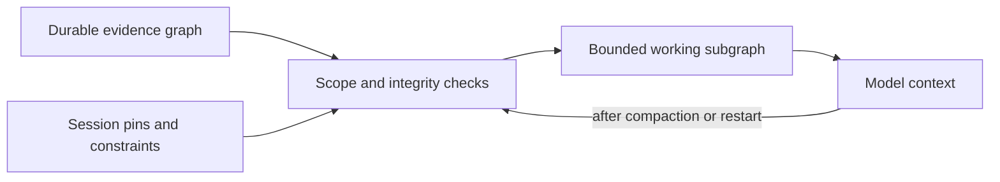

# Session continuity and the knowledge graph

The durable graph is the memory; context is a bounded working view of that memory.
Compaction may replace that working view, but must not become the authority for
facts, permissions, skill versions, or completed work.

## Three different graphs

- The execution DAG in `src/graph.ts` schedules dependent work. Its authoritative
  state is under `.opencode/runs/`; it is not a general knowledge graph.
- The experience graph in `src/experience.ts` contains immutable, project-scoped,
  content-addressed observations, hypotheses, actions, outcomes, datasets, skill
  versions and evaluations. Typed edges include supports, refutes, tests,
  derived_from, produced and supersedes. The DuckDB catalog is a rebuildable
  index, not source authority. Intake is currently explicit, not automatic.
- The session recovery checkpoint added here is a small session-owned index into
  existing state. It is NOT yet a graph retrieval engine or conversation archive.

## Implemented in this repair

1. **Whole instructions.** Only matching, complete skill bodies are injected.
   At most three bodies are considered; each must fit the 6 KiB body limit and
   12 KiB formatter budget. Otherwise name, source, hash, byte size and
   `requires_full_load` are emitted. No-match requests activate no arbitrary
   skill. Catalog metadata never claims to be loaded instructions.
2. **Source isolation.** Live capture validates SDK session identity, project,
   directory, deletion and recursion exclusions before message reads, then
   revalidates before evidence publication. Automatic capture excludes ALG
   executor children; explicit manual audit retains its existing executor policy.
   Host-supplied envelopes must all belong to the same validated session.
3. **Earlier capture and honest gaps.** In addition to enqueue/compact capture,
   normal message transforms capture a detached copy of eligible completed
   envelopes already supplied by the host. Both normal-boundary and compact
   capture have a two-second outer deadline (or the smaller configured timeout).
   Late completion cannot publish through an expired capture operation. Independently
   started enqueue capture may still finish; coverage records describe the
   checkpoint instant, not every future event.
4. **Owned budgets.** Run recovery comes first, evidence coverage next, active
   skill references last. Only ALG-owned compaction chunks share the 32 KiB
   budget. Pre-existing other-plugin chunks remain byte-for-byte unchanged.
   OpenCode owns the final model-token budget; ALG cannot guarantee that a host
   will include every plugin's text in its final prompt.
5. **Durable active skill identity.** Successful complete system injections and
   observed successful skill-tool loads retain name/root/target/hash in
   `.opencode/skill-evolution/session-recovery/<hashed-session>.json`.
   The formatter selects these session references rather than the first catalog
   names. Missing, uncatalogued or changed versions are explicit. Changed identities
   are not silently replaced by a new body. Full system injection is counted as
   loaded for the matching user turn while that runtime's injection receipt exists;
   arbitrary historical turns do not inherit it.
6. **Rehydration outside the summary.** Later system transforms reload latest
   owned incomplete run state, active skill references and last recorded coverage.
   Recovery therefore does not depend exclusively on the compaction model retaining
   a paragraph. Evidence gaps remain visible even after an audit row becomes failed.

Recovery files are schema-checked, atomically replaced under the existing project
mutex, bounded to 64 KiB each, and bound to the canonical project and exact session.
There are at most 32 retained skill identities per session and 4,096 recovery
files per project. Capacity stops writes visibly instead of evicting old references.
No transcript, credential value, or graph-node prose is copied into these files.
Skill paths themselves can reveal project naming; treat the files as private.
Deleted-session checkpoints are not reinjected; deletion is not a claim that every
previously stored byte has been erased.

## Important limitations

- This is not lossless conversational memory. A turn removed before any capture
  point remains unavailable. The regression deliberately preserves that failure.
  A true zero-loss guarantee requires a host-supported pre-compaction barrier or
  an authoritative append-only message/part stream with replay cursors.
- Evidence is already redacted and bounded; “captured” means an attached evidence
  reference exists, not that all raw tool output or the entire chat was retained.
  Hash/schema verification still occurs when evidence is read for audit.
- A successful skill-tool event identifies a name, not a historical content hash.
  Its checkpoint hash is the catalog identity observed by ALG. Exact bodies directly
  injected by ALG have stronger provenance. The first retained identity is preserved
  on drift; a user must review and explicitly load a changed version. There is not
  yet an automated reviewed-repin workflow.
- Fresh run/status reads are authoritative; a coverage checkpoint is a timestamped
  snapshot. It can conservatively continue warning after later capture succeeds,
  until the next compaction refresh. Missing/corrupt checkpoints are warnings,
  not fabricated empty success.
- Learning remains opt-in. The existing SDK V1 model-call safety gate is unchanged.
  No real model, PostgreSQL replica, Kubernetes cluster, S3/Iceberg environment or
  production MCP is used by the synthetic regression tests.
- General conversation goals, constraints, decisions and open questions are NOT
  automatically extracted into the experience graph by this repair. Only goals
  and criteria already recorded in ALG runs have that existing durable authority.

## How the graph should live in context next

Use a small **session working subgraph**, not a serialized dump of the whole graph.
The model sees readable statements with stable IDs, provenance, status and
relationships. Full receipts, query results and logs remain on disk and are fetched
only when needed.

Recommended flow (the graph-selection portion is proposed, not implemented):



The session checkpoint should bind a monotonically increasing revision, parent
checkpoint hash, exact project/session identity, latest source-event cursor,
pinned node IDs, active run IDs, skill versions, unresolved questions, and
capture coverage. Publish immutable evidence first and the checkpoint last.
Do not advance a source cursor past a failed durable write.

Always reserve context for the current goal, user constraints, permission boundary,
open blockers, next verifiable action, missing-data warnings, and checkpoint pointer.
Then select relevant observations and their supporting AND refuting evidence.
Suggested initial retrieval bounds are two hops, 24 nodes and 48 edges, subject
to an independent byte/token budget. These are proposed starting limits, not
implemented constants or measured optimal values. Emit omission counts and a
retrieval handle whenever something is left out. If mandatory pins alone exceed
the budget, report that condition rather than silently dropping constraints.

An illustrative troubleshooting projection could read:

```text
Goal: explain slow replica queries; no production writes.
Observation obs-17 [observed]: replica lag increased; receipt=<hash>, observed_at=<time>.
Hypothesis hyp-4 [inferred]: replica lag causes the dashboard delay.
obs-17 supports hyp-4; obs-22 refutes hyp-4.
Action act-9 [proposed]: compare query plans on the allowed replica.
Blocked: current permission has not been revalidated.
Next: read the two receipts, then choose a discriminating read-only test.
```

Those abbreviated IDs are illustrative; actual nodes use full validated hashes.
An inferred hypothesis must never become “the root cause” merely because it was
repeated in a summary. A proposed action is never approval to execute it.

For data science, pin dataset snapshot/version, grain, units, join keys, cohort and
time-window definitions, null policy, quality findings, train/test boundaries,
and reproducible query/notebook/receipt hashes. Raw sensitive rows stay out of
automatic context. For troubleshooting, pin environment identity, incident timeline,
competing hypotheses, failed attempts, rollback plan and verification criteria.
Remember *why* a hypothesis was rejected so compaction does not trigger the same
unhelpful experiment repeatedly.

Environment facts need freshness: “port reachable yesterday” is an observation,
not a current guarantee. Credentials should be provider/reference/scope/expiry
metadata only, never secret values. Revalidate current permissions independently
before action; graph memory cannot grant authority.

## Next implementation slice and acceptance gate

The sequenced delivery plan is now in [environment-aware skill and session memory](session-memory-implementation-plan.md).

1. Add a versioned session checkpoint contract for goal/constraint/decision pins,
   source cursors and explicit user-authorized changes. Add session ownership and
   visibility rules to graph retrieval first: the current experience schema is
   project-private, which is not sufficient for private multi-session retrieval.
2. Add deterministic bounded traversal from pinned IDs and task entities. Verify
   node content hashes, project/session visibility, edge targets, supersession and
   staleness before rendering untrusted evidence separately from instructions.
   Include contradictions; abstain when sources cannot be verified.
3. Add a read-only “expand evidence by ID” interface and context-budget receipt
   reporting selected IDs, omitted IDs/counts and selection reasons. Existing local
   JSON and the rebuildable DuckDB index suffice initially; a new graph database,
   vector service or MCP is not required to establish correctness.
4. Gate on synthetic interrupted-write/restart/compaction tests: 20 repeated
   compactions preserve every mandatory pin and unknown; foreign-session and
   tampered nodes never enter context; stale permissions never authorize an action;
   failed writes do not advance cursors; full budgets expose omissions; repeated
   replay is idempotent. Add separate latency/token measurements before enabling
   automatic graph retrieval by default.

The objective is not “remember everything in the prompt.” It is “keep the
authoritative facts recoverable, and know exactly what is missing.”

## Repair verification — 2026-09-20

The subsequent opt-in implementation is documented in [session memory](session-memory.md).
The counts below describe only the original recovery repair, not the new memory gate.

Based on main merge `1a0465d6ac5d2c8a8ce9280f4c170227deb82130` (PR #3).
TypeScript validation passed. The synthetic acceptance set passed 95 tests with
520 assertions across `architecture-audit`, `skill-catalog`,
`skill-evolution-runtime`, `skill-evolution-evidence-schema`,
`skill-evolution-store` and `experience` test files. This is a targeted regression
set, not the entire release gate or a live OpenCode/model compaction acceptance run.
The repair is on `codex/compaction-recovery-20260920`; installation, commit and
push are separate steps.

## Current status

The September 20 paragraphs above are the baseline for that repair. They are not
the current tree. The canonical checkout is commit `dc55386` on `origin/main`,
in the worktree `D:\alg-worktrees\compaction-recovery-20260920`. Later changes
branch from that commit.
